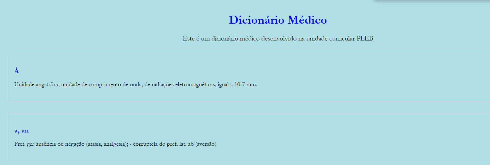

# TPC3

No ficheiro tpc3.ipynb, encontra-se a resolução do TPC3 proposto nesta Unidade Curricular.

A ficha permitiu consolidar obtidos na aula prática correspondente, nomeadamente extração de informações usando expressões regulares e a geração de documentos HTML.

A principal dificuldade encontrada foi lidar com quebras de página (ff), que interferiram na formatação. Esta dificuldade não foi ultrapassada dada a sua complexidade.

No HTML, foram aplicadas melhorias na apresentação visual do conteúdo, nomeadamente,no tipo e cor da fonte, definição de margens modificação da cor de fundo e a utilização de elementos "div>" para organizar o conteúdo de forma mais estruturado.

Encontra-se abaixo um screenshoot do documento html melhorado:
