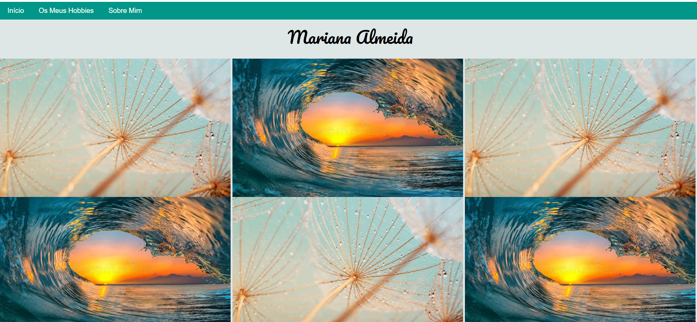
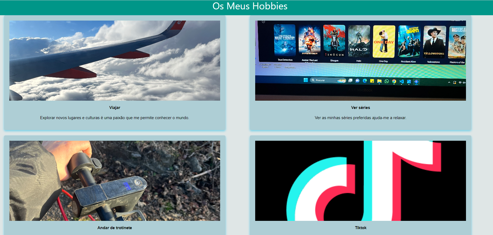
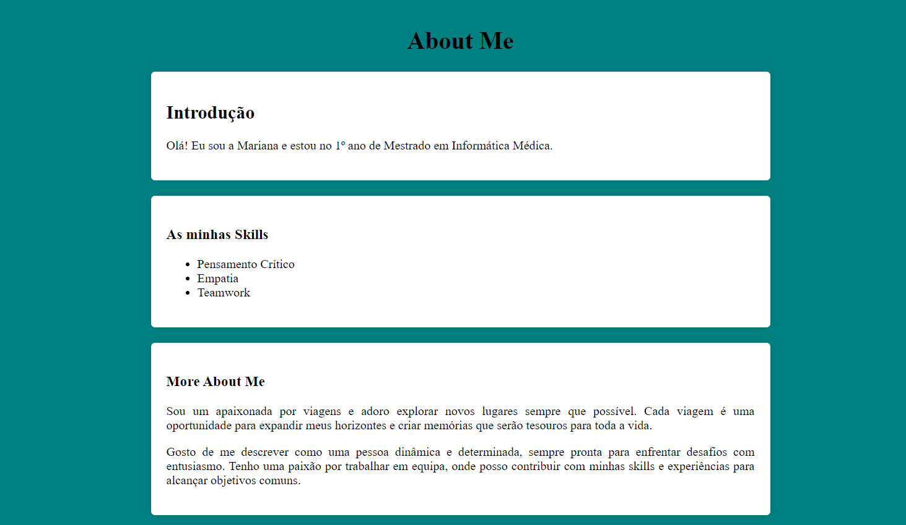

# TPC4 - Página HTML sobre Hobbies

Este projeto tinha como objetivo criar uma página HTML sobre os meus hobbies. Utilizou-se HTML e CSS para desenvolver a página, inserindo imagens e texto para descrever cada um dos meus hobbies.

## Principais Dificuldades:

1. **Inserção de um vídeo:** Enfrentei dificuldades ao tentar colocar um vídeo na página HTML. Tentei incluir um elemento de vídeo, mas não consegui fazê-lo funcionar corretamente.
   
2. **Tamanho de imagens**: Encontrei dificuldades derivadas dos diferentes tamanhos de cada imagem que desformatavm a página html.

## Destaques:

Destaca-se a colocação de imagens para representar cada um dos meus hobbies, utilizando a tag `` e o atributo `src` para especificar o caminho das imagens. Além disso, destaca-se ainda a utilização das tags de âncora `<a>` com o atributo `href` para criar links para páginas externas. Adicionalmente, foi aplicada sombra na caixa dos hobbies para criar um efeito visual agradável e ainda a transformação das imagens quando o cursor do rato está sobre elas, criando um efeito de elevação.
Implementou-se, também, uma funcionalidade de menu de navegação para mostrar apenas a página correspondente ao item clicado.

## Screenshoot da Página Desenvolvida

Abaixo, encontram-se screenshoots da página desenvolvida:

