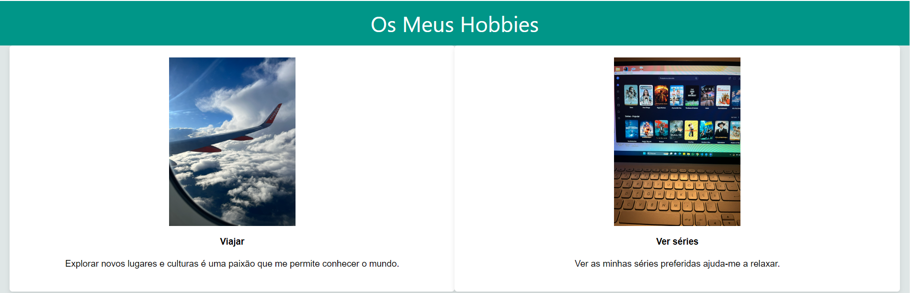
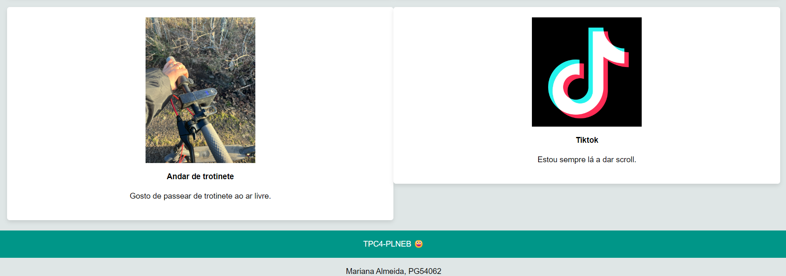

# TPC4 - Página HTML sobre Hobbies

Este projeto tinha como objetivo criar uma página HTML sobre os meus hobbies. Utilizou-se HTML e CSS para desenvolver a página, inserindo imagens e texto para descrever cada um dos meus hobbies.

## Principais Dificuldades:

1. **Inserção de um vídeo:** Enfrentei dificuldades ao tentar colocar um vídeo na página HTML. Tentei incluir um elemento de vídeo, mas não consegui fazê-lo funcionar corretamente.
   
2. **Formatação de Imagens Diferentes:** Inicialmente, as imagens selecionadas diferentes, o que causava problemas de formatação na página. Tentei ajustar o tamanho das imagens para que todas aparecessem de forma consistente, mas encontrei dificuldades nesse processo. No final, optei por colocar as imagens todas do mesmo tamanho.

## Destaques:

Destaca-se a colocação de imagens para representar cada um dos meus hobbies, utilizando a tag `` e o atributo `src` para especificar o caminho das imagens. Além disso, destaca-se ainda a utilização das tags de âncora `<a>` com o atributo `href` para criar links para páginas externas.

## Screenshoot da Página Desenvolvida

Abaixo, encontram-se screenshoots da página desenvolvida:

