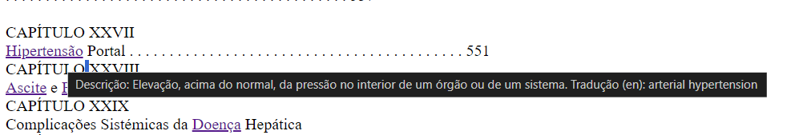

# TPC5- Descrição e Tradução de Termos num livro médico.

## Objetivo

Neste trabalho de casa, o principal objetivo foi enriquecer um livro médico com traduções de termos para inglês e as respetivas descrições em portugês. A ideia era que, ao passar o mouse sobre os termos presentes no livro, fosse exibida a descrição em português e a tradução do conceito em inglês. 

## Passos Realizados

### Leitura dos Dados

Inicialmente, foram abertos e lidos três tipos de ficheiros: um ficheiro `conceitos.json` que continha os conceitos em português e respetivas descrições, um ficheiro de texto `termos_traduzidos` contendo as traduções dos conceitos e o livro médico `LIVRO-Doenças-do-Aparelho-Digestivo.txt`.

### Construção do Dicionário de Tradução
Com o padrão ` r'(.+)\s@\s(.+)\n'`, foram extraídas as traduções dos conceitos presentes no ficheiro de termos traduzidos, ficando como uma lista de tuplos `(design_pt,desig_en),.])`

De seguida, percorreu-se os conceitos presentes no dicionário **conceitos** e, para cada conceito, procurou-se pela tradução correspondente na lista de tuplos (**traduzidos**). Se a tradução fosse encontrada, esta era adicionada ao dicionário novo_dic junto com a descrição em português do conceito. Caso não houvesse tradução disponível, apenas era adicionada a descrição em português ao novo_dic.

Após a construção do novo dicionário guardado no ficheiro denominado **dic_trad.json** (presente na pasta data), o próximo passo consistiu em integrar estas informações ao livro médico. Assim, foi desenvolvida a função _etiquetador_ para que, ao passar o rato sobre os termos presentes no livro, fosse projetada a descrição em português e a tradução do conceito em inglês.

## Dificuldades e Destaques

Uma das principais dificuldades encontradas foi lidar com os casos em que nem todos os conceitos possuíam tradução em inglês, que foi identificado mais tarde,após a contagem das linhas no **conceitos.json** e no ficheiro **termos_traduzidos**. Isto exigiu uma nova abordagem para garantir que mesmo que o termo não tivesse tradução, fosse apresentada a sua descrição ( a solução prévia não cobria estes casos, mas está presente em comentário).

## Screenshoots

A seguir estão presentes algumas imagens do resultado final:

1. **Exemplo do Livro Médico:**  
   
   *Legenda:* Screenshoot com a descrição em português e a tradução em inglês ao passar o mouse sobre um termo no livro médico.

2. **Dicionário de Tradução Gerado:**  
   

   *Legenda:* Screenshoot do dicionário de tradução gerado, com a associação entre os conceitos em português e as respetivas traduções em inglês.

Com estas imagens, é possível visualizar o processo realizado e os resultados obtidos ao inserir as traduções e as descrições ao livro médico.
