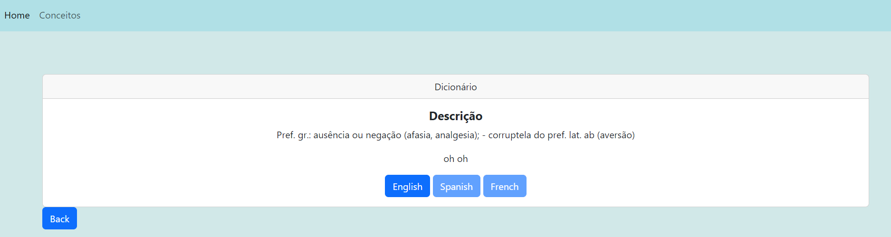

# **TPC6**
## Adição da Descrição e Tradução de Termos a uma página -FLASK

## Objetivo
Neste trabalho de casa foi demonstrado como criar uma rota para consultar conceitos num dicionário usando o Flask, e como visualizar as descrições dos conceitos e o conceito em inglês numa página HTML utilizando Jinja2 e CSS.

## Procedimento
Foi criado um template HTML utilizando o framework de template Jinja2 e foi extendido a partir de um layout `layout.html`. Dentro do bloco body, implementou-se um estilo CSS para ocultar um elemento com o id design_en quando o botão não é clicado. No corpo do HTML, foi renderizado um card com título e parágrafo com a descrição do conceito em português. 
Adicionalmente, foi incluída a descrição do conceito em inglês com o ID design_en, que foi ocultado inicialmente. O botão`English` permite ao utilizador visualizar a tradução em inglês ao clicar nele. Também foram utilizadas classes do Bootstrap para estilizar os botões de idioma, desativando os botões de espanhol e francês para indicar que as traduções não estão disponíveis.

## Dificuldades:

1. Implementar a funcionalidade de mostrar a tradução em inglês apenas ao clicar no botão `English`.

2. Incluir uma imagem (static) na página home.
Todas as dificuldades foram ultrapassadas com sucesso, ainda que de forma demorada.

## Destaques:

1. Utilização de classes do Bootstrap para melhorar o visual da página.

2. Utilização de uma estrutura de cartão `
` para apresentar as informações de forma organizada.

3. Implementação de um estilo CSS para a descrição em inglês ficar oculta antes de clicar no botão, o que garante uma apresentação limpa e focada na descrição em português.

4. Preparação da página para posterior inclusão de outros idiomas, onde se desativou os botões de espanhol e francês para indicar que as traduções não estão disponíveis.

5. Adição de um botão `Back`para voltar à página anterior.

## Screenshoots

A seguir estão presentes algumas imagens do resultado final:

