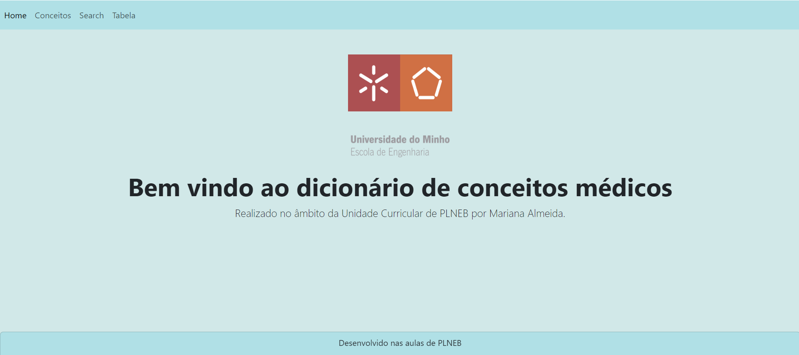
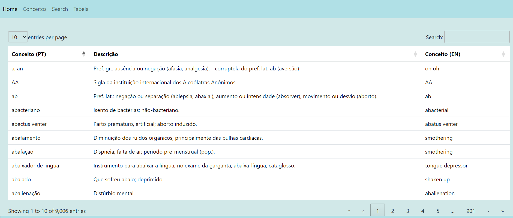
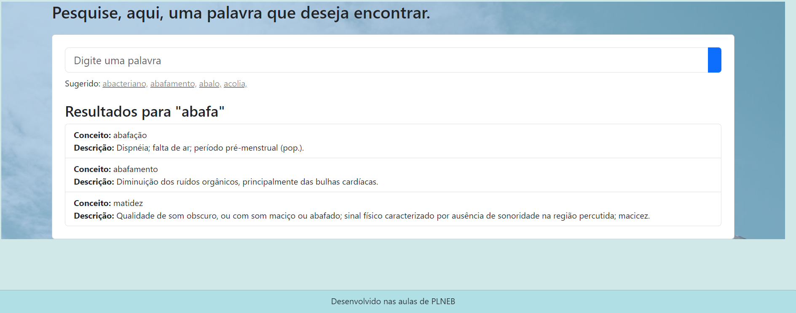
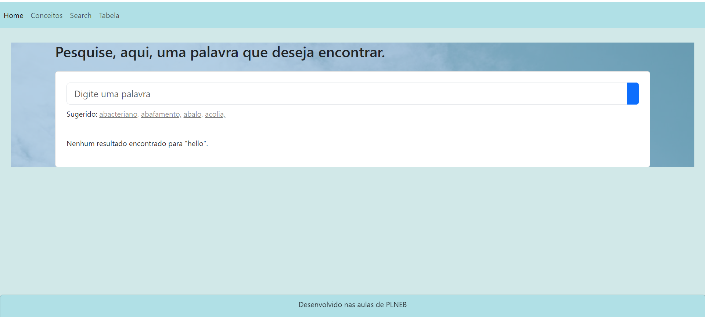
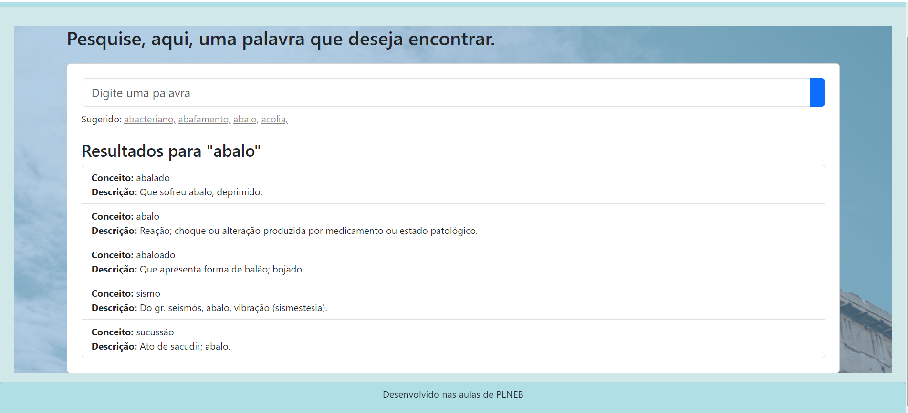

# **TPC7**
## Pesquisa por Palavra e Criação de Tabela

## Objetivos:
O objetivo deste trabalho de casa foi implementar a funcionalidade de pesquisar por palavras-chave e  a funcionalidade de visualização do dicionário `conceitos` numa tabela formatada.

## Destaques:
1. Uso de templates para o desenvolvimento das duas páginas HTML;
2. Adição de referências à barra de navegação para a página de pesquisa e para página onde a tabela se encontrava apresentada;
3. Palavras sugeridas na barra de pesquisa são interativas, permitindo que os utilizadores cliquem nelas para serem direcionados à página de resultados correspondentes.
4. Resultados da tabela apresentados em três colunas: conceito em português, descrição e conceito em inglês, proporcionando uma apresentação estética e organizada da informação;
5. A barra de pesquisa é visualmente atraente, contribuindo para a estética geral da página.
6. A Homepage foi remodelada com recurso a templates do Bootstrap.

## Dificuldades:

1. Garantir que a estrutura do dicionário de conceitos (conceitos) estivesse corretamente configurada para ser utilizada nos templates HTML.
2. Lidar com a lógica de pesquisa para garantir que os resultados fossem filtrados corretamente com base na palavra-chave fornecida pelo utilizador.
3. Garantir que a formatação HTML fosse consistente e responsiva em diferentes dispositivos e tamanhos de tela.

**HomePage**

**Tabela de Conceitos (table.html):**

**Página de Pesquisa (pesquisa.html):**

